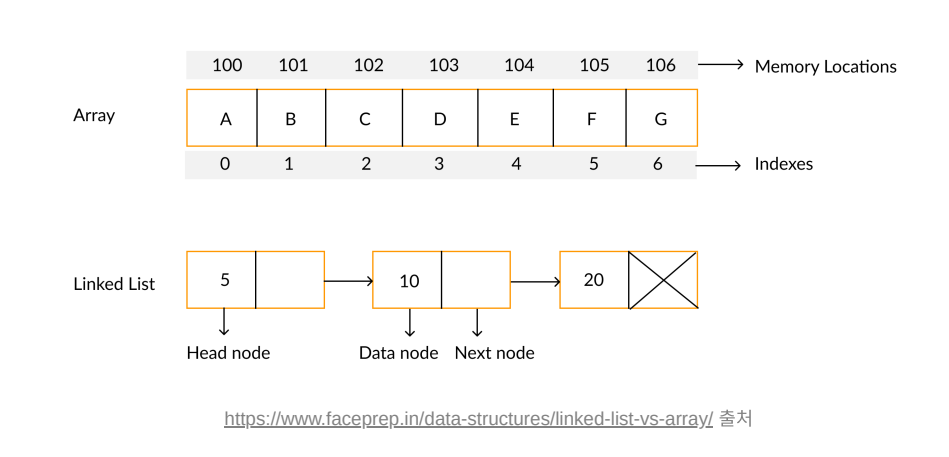

## Python 알고리즘 공부

<a href="https://available-parent-09c.notion.site/TIL-e74b792f460e4a7fa72987bfbfe2cf94"></a>

[파이썬 문법](https://www.notion.so/27bc2c0f9f18444ba646ba94fc12f194)


**목차**

- [시간복잡도 & 공간복잡도](#시간복잡도-&-공간복잡도)

- [점근표기법](#점근표기법)

- [알고리즘 풀이 팁](#알고리즘-풀이-팁)

- [자료구조](#자료구조)

- [클래스](#클래스)

- [링크드 리스트](#링크드-리스트)


---


## 시간복잡도 & 공간복잡도

### 시간복잡도

- 각 줄이 실행되는 걸 1번의 연산이 된다 라고 생각하고 계산
- array의 길이(입력값)  = N
  - 입력값이란 함수에서 크기가 변경될 수 있는 값으로 배열을 받고 있으면 배열이 입력값이다.

### 공간복잡도

- 저장하는 데이터의 양이 1개의 공간을 사용한다고 계산

### ex. 시간, 공간 복잡도

```python
input = "hello my name is sparta"

# 공간 복잡도
# alphabet_array 의 길이 = 26
# arr_index, max_occurrence, max_alphabet_index, alphabet_occurrence 변수 = 4
# 이 함수는 총 30 만큼의 공간이 사용됨
# 공간을 더 적게 쓴 첫 번째 방법이 더 효율적일까?
# 29와 30 모두 상수라 큰 상관이 없다. 대부분의 문제에서는 알고리즘의 성능이 공간에 의해서 결정되지 않는다
# 따라서 공간 복잡도보다는 시간 복잡도를 더 신경 써야 한다.
# 시간 복잡도
# 1. string 의 길이 * (비교 연산 1번 + 대입 연산 2번)
# 2. 대입 연산 2번
# 3. alphabet_array 의 길이 * (비교 연산 1번 + 대입 연산 3번)
# string 의 길이는 보통 N 이라고 표현
# N * (1 + 2) + 2 + 26 * (1 + 3) = 3N + 106
# 상수는 제외하고 N 만큼의 시간이 필요하다고 생각
def find_max_occurred_alphabet(string):
    alphabet_occurrence_array = [0] * 26

    for char in string:
        if not char.isalpha():
            continue
        arr_index = ord(char) - ord("a")
        alphabet_occurrence_array[arr_index] += 1

    max_occurrence = 0
    max_alphabet_index = 0
    for index in range(len(alphabet_occurrence_array)):
        alphabet_occurrence = alphabet_occurrence_array[index]

        if alphabet_occurrence > max_occurrence:
            max_alphabet_index = index
            max_occurrence = alphabet_occurrence

    return chr(max_alphabet_index + ord("a"))

result = find_max_occurred_alphabet(input)
print(result)
```


---


## 점근표기법 

### 점근 표기법이란?

<aside> 💡 알고리즘의 성능을 수학적으로 표기하는 방법. 알고리즘의 "효율성"을 평가하는 방법이다. 점근 표기법(asymptotic notation)은 어떤 함수의 증가 양상을 다른 함수와의 비교로 표현하는 수론과 해석학의 방법이다. 시간 복잡도와 공간 복잡도에서 다루었던 N 표기의 분석방법이 점근 표기법의 일종이라고 말할 수 있다.

</aside>

### 점근 표기법 종류

- 빅오(Big - O) 표기법
  - 빅오 표기법은 최악의 성능이 나올 때 어느 정도의 연산량이 걸릴것인지에 대해 표기한다.
  - **ex.)** O(N) 의 시간복잡도를 가진 알고리즘이다.
- 빅 오메가(Big - Ω) 표기법
  - 빅 오메가 표기법은 최선의 성능이 나올 때 어느 정도의 연산량이 걸릴것인지에 대해 표기한다.
  - **ex.)** Ω(1) 의 시간복잡도를 가진 알고리즘이다.

### ex.

```python
input = [3, 5, 6, 1, 2, 4]

# 시간 복잡도
# 1. array 의 길이
# 2. 비교 연산 1번
# N * 1 = N 만큼의 시간 복잡도
# 3 이 아닌 4 가 입력값이 였다면 성능이 동일하지 않다 (4가 배열상 맨 뒤에 있음으로)
# 입력값이 좋을때 1 , 안 좋을 때 N
# 빅 오메가 Ω(1), 빅 오 O(N)
def is_number_exist(number, array):
    for element in array:         # 1
        if number == element:         # 2
            return True             # N * 1 = N 만큼의 시간 복잡도

    return False

result = is_number_exist(3, input)
print(result)
```


---


## 알고리즘 풀이 팁

<aside> 💡 알고리즘 문제를 풀다보면, 문제 자체를 이해하기 힘들 때가 있다.

그럴때는 이렇게 해보자.

</aside>

1. 바로 코드를 작성하지 말고, 문제의 다른 예시들을 떠올리면서 규칙성을 생각해보자.

   ex.) 00000 은 최소 횟수를 어떻게 구할까?

2. 어떤 자료구조를 써야하는지 생각한다.

   ex.) 스택, 큐

3. 문제의 특징들을 하나하나 써보기

   ex.) 문자열을 뒤집어야 하는데, 0으로 할지 1로 할지 고민 된다. 뒤집는 걸 감지할만한 시점은 0에서 1로, 1에서 0으로 바뀌는 시점인데, 초기에 0인지 1인지도 횟수에 연관이 있다.

   

---


## 자료구조


### 자료구조는 왜 배울까?

<aside> 💡 특정 자료구조는 삽입/삭제가 빠르고 특정 자료구조는 조회가 빠르다.

이처럼 어떤경우에는 이 자료구조가 좋고, 어떤 경우에는 저 자료구조가 좋은 것 처럼 경우에 따라 다양한 자료구조와 알고리즘을 사용해야 한다.

</aside>

### Array & Linked List



### Array 배열

- 배열은 크기가 정해진 데이터 공간으로 한 번 정해지면 바꿀 수 없다.

- 배열은 각 원소에 즉시 접근할 수 있다. 

  ```
  musics[0]
  ```

  - 여기서 원소의 순서는 0 부터 시작하고 이를 인덱스라고 부른다.
  - 즉시 접근 가능하다는 말은 상수 시간 내에 접근할 수 있음을 의미한다.
  - 즉 , 빅오표기법으로 O(1) 내에 접근할 수 있다고 말한다.

- 배열은 원소를 중간에 삽입/삭제 하려면 모든 원소를 다 옮겨야 한다.

  - 최악의 경우 배열의 길이 N만큼 옮겨야 하므로 O(N)의 시간 복잡도를 가진다.

- 원소를 새로 추가하려면, 새로운 공간을 할당해야 하므로 매우 비효율적인 자료구조이다.

### Linked List 리스트

- 리스트는 크기가 정해지지 않은 데이터 공간이므로 자유자재로 늘어날 수 있다.
- 리스트는 특정 원소에 접근하려면 연결 고리를 따라 탐색해야 한다.
  - 최악의 경우에는 모든 화물 칸을 탐색해야 하므로 O(N)의 시간 복잡도를 가진다
  - 여기서, 앞으로 연결 고리를 포인터라 부르고, 각 화물 칸을 노드라고 부른다.
- 리스트는 원소를 중간에 삽입/삭제 하기 위해서는 앞 뒤의 포인터만 변경하면 된다.
  - 따라서 원소 삽입/삭제를 O(1)의 시간 복잡도 안에 할 수 있다.

### 정리

| 경우             | Array                                                        | Linked List                                                  |
| ---------------- | ------------------------------------------------------------ | ------------------------------------------------------------ |
| 특정 원소 조회   | O(1)                                                         | O(N)                                                         |
| 중간에 삽입/삭제 | O(N)                                                         | O(1)                                                         |
| 데이터 추가      | 데이터 추가 시 모든 공간이 다 차버렸다면 새로운 메모리 공간을 할당 받아야 한다 | 모든 공간이 다 찼어도 맨 뒤의 노드만 동적으로 추가하면 된다. |
| 정리             | 데이터에 접근하는 경우가 빈번하다면 Array를 사용한다.        | 삽입/삭제가 빈번하다면 LinkedList를 사용한다.                |

<aside> 💡 파이썬에서의 list 는 Array지만 내부적으로 동적 배열이라는 것을 사용해서, 배열의 길이가 늘어나도 (ex. `append()`) O(1)의 시간복잡도가 걸리도록 설계되어있다. 파이썬의 배열은 링크드 리스트로 쓸 수 있고 배열로도 쓸 수 있게 만든 효율적인 자료구조이다.

</aside>

------


## 클래스

### 클래스란?

- 클래스는 분류. 집합. 같은 속성과 기능을 가진 객체를 총칭하는 개념이다.

### 객체란?

- 객체는 세상에 존재하는 유일무이한 사물이다.

<aside> 💡 예를 들면 클래스가 사람이라면, 객체는 유재석이 될 수도, 박명수가 될 수도 있다. 클래스가 동물이라면, 객체는 강아지가 될 수도, 고양이가 될 수도 있다. 이처럼, 클래스를 이용하면 같은 속성과 기능을 가진 객체들을 묶어서 정의할 수 있다.

</aside>

**ex.) 객체가 저장되어있는 주소값을 알려주어서 이 객체가 person_1 인지 person_2 인지 구분할 수 있게 한다.**

```python
class Person:
	pass 

person_1 = Person()
print(person_1) # <__main__.Person object at 0x00000192259486D0>
person_2 = Person()
print(person_2) # <__main__.Person object at 0x0000019225948190>
```

<aside> 💡 클래스에는 생성자(Constructor) 라는 게 있는데 객체를 생성할 때 데이터를 넣어주거나, 내부적으로 원하는 행동을 실행하게 할 수 있다.

파이썬에서 생성자 함수의 이름은 `__init__` ****으로 고정되어 있다. 무조건 생성자 이름의 함수는 ****`__init__` ****이다.

`()` ← 이부분이 생성자를 호출 = `__init__` 호출 생성자는 생성시에 호출되는 함수이며 아래처럼 Person을 생성하기만 해도 i am created! 와 self 가 동시에 출력된다.

self 는 객체 자기 자신을 가르킨다. 따라서, 파라미터를 따로 넣어줄 필요가 없이 그냥 호출하면 알아서 자기자신을 self에 넣는다.

</aside>

**ex.) self의 출력 결과**

```python
class Person:
    def __init__(self):
        print("i am created! ", self)

person_1 = Person()
print(person_1)
person_2 = Person()
print(person_2)

출력

i am created!  <__main__.Person object at 0x00000221A94E8100>
<__main__.Person object at 0x00000221A94E8100>
i am created!  <__main__.Person object at 0x00000221A998B670>
<__main__.Person object at 0x00000221A998B670>
```

<aside> 💡 self를 사용해서 객체에 데이터를 쌓을 수 있다.

</aside>

**ex.) 파라미터를 이용해 자기자신에게(self) name 이라는 변수를 만들어 할당**

```python
class Person:
    def __init__(self, param_name):
        print("i am created! ", self)
        self.name = param_name

person_1 = Person("유재석")
print(person_1.name)
person_2 = Person("박명수")
print(person_2.name)

출력

i am created!  <__main__.Person object at 0x000002A212418100>
유재석
i am created!  <__main__.Person object at 0x000002A21288B7F0>
박명수
```

<aside> 💡 클래스에 메소드(함수)를 추가 할 수 있다.

</aside>

**ex.)**

```python
class Person:
    def __init__(self, param_name):
        print("i am created! ", self)
        self.name = param_name

    def talk(self):
        print("안녕하세요, 제 이름은", self.name, "입니다")

person_1 = Person("유재석")
person_1.talk()
person_2 = Person("박명수")
person_2.talk()

출력

i am created!  <__main__.Person object at 0x000001353E388100>
안녕하세요, 제 이름은 유재석 입니다
i am created!  <__main__.Person object at 0x000001353E3CA7F0>
안녕하세요, 제 이름은 박명수 입니다
```


---


## 링크드 리스트

### 링크드 리스트 이해하기 (구현해보기)

```python
train_compartments = ["기관실"] -> ["시멘트"] -> ["자갈"] -> ["밀가루"] -> ["우편"]
```

<aside> 💡 노드는 아래 두 가지 정보가 필요하다

1. 칸에 있는 데이터
2. 다음 칸이 뭔지

</aside>

**ex.)**

```python
class Node:
		def __init__(self, data):
				self.data = data
				self.next = None

# 3을 가진 Node 를 만드려면 
node = Node(3) # 현재는 next 가 없이 하나의 노드만 있다. [3]
```

<aside> 👉 노드들을 만들어서 연결해보자

</aside>

**ex.)**

```python
first_node = Node(5) # 현재는 next 가없이 하나의 노드만 있다. [5]
second_node = Node(12) # [12] 를 들고있는 노드를 만든다.
first_node.next = second_node # [5]의 next 를 [12] 로 지정한다. [5] -> [12]
```

<aside> ✅ 이렇게 매번 노드를 연결할 수는 없으니 클래스를 사용해서 만들어보자

1. LinkedList 는 self.head 에 시작하는 노드를 저장한다.
2. 다음 노드를 보기 위해서는 각 노드의 next 를 조회해서 찾아가야 한다.

</aside>

**ex.)**

```python
class Node:
    def __init__(self, data):
        self.data = data
        self.next = None

node = Node(3)
fist_node = Node(4)
node.next = fist_node

class LinkedList:
    def __init__(self, data):
        self.head = Node(data)  # Node 에 데이터를 심어주기 때문에 자동으로 Node 가 생성됨

    def append(self, data):
        if self.head is None:
            self.head = Node(data)
            return

        cur = self.head
        while cur.next is not None:  # [3] -> [4]
            cur = cur.next  # cur -> cur        cur 이 None 까지 움직이고
            print("cur is ", cur.data) # None 전에 위치의 data 를 출력
        cur.next = Node(data)  # None 위치에 새로운 Node 를 만든다.

    def print_all(self):
        print("i'm going to None")
        cur = self.head
        while cur is not None:
            print(cur.data)
            cur = cur.next

# [3] -> [4] -> [5] -> None

linked_list = LinkedList(3)
linked_list.append(4)
linked_list.append(5)
linked_list.print_all()
```


### 링크드 리스트 index번째 작업

<aside> ❓ 링크드 리스트에서 index번째 원소를 반환, 추가, 삭제하시오.

</aside>

ex.)

```python
class Node:
    def __init__(self, data):
        self.data = data
        self.next = None

class LinkedList:
    def __init__(self, value):
        self.head = Node(value)

    def append(self, value):
        cur = self.head
        while cur.next is not None:
            cur = cur.next
        cur.next = Node(value)

    def print_all(self):
        cur = self.head
        while cur is not None:
            print(cur.data)
            cur = cur.next

    def get_node(self, index):
        node = self.head
        count = 0
        while count < index:
            node = node.next
            count += 1
        return node

    def add_node(self, index, value):
        new_node = Node(value)  # [6]
        if index == 0:
            new_node.next = self.head  # [6] -> [5]
            self.head = new_node  # head -> [6] -> [5] ->  .... 헤드교체
            return

        node = self.get_node(index - 1)  # [5]
        next_node = node.next  # [12]
        node.next = new_node  # [5] -> [6]
        new_node.next = next_node  # [6] -> [12]

    #   index     next_node
    # ["자갈"] -> ["밀가루"] -> ["우편"]
    #       new_node
    #    -> ["흑연"] ->

    def delete_node(self, index):
        if index == 0:
            self.head = self.head.next
            return

        node = self.get_node(index - 1)
        node.next = node.next.next

linked_list = LinkedList(5)
linked_list.append(12)
linked_list.add_node(0, 3)
linked_list.print_all()
linked_list.delete_node(0)
linked_list.print_all()
```
