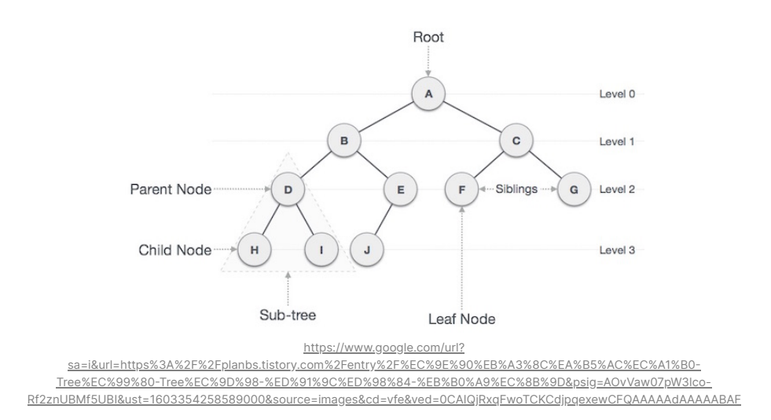
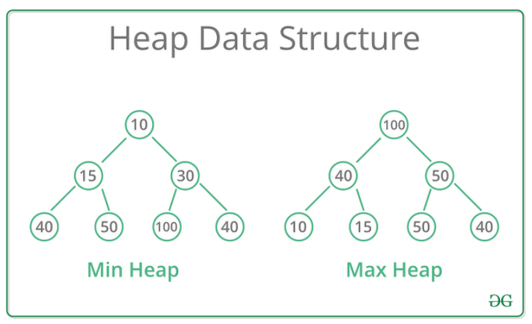
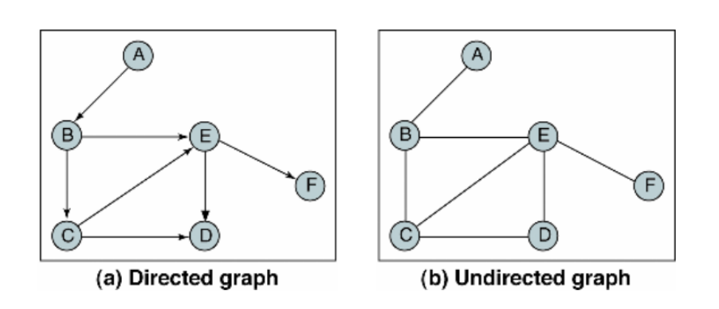

Python 알고리즘 공부

<a href="https://available-parent-09c.notion.site/TIL-e74b792f460e4a7fa72987bfbfe2cf94"></a>

[파이썬 문법](https://www.notion.so/27bc2c0f9f18444ba646ba94fc12f194)


**목차**

- [시간복잡도와 공간복잡도](#시간복잡도와-공간복잡도)
- [점근표기법](#점근표기법)
- [알고리즘 풀이 팁](#알고리즘-풀이-팁)
- [자료구조](#자료구조)
- [클래스](#클래스)
- [링크드 리스트](#링크드-리스트)
- [이진 탐색과 순차 탐색](#이진-탐색과-순차-탐색)
- [정렬](#정렬)
- [스택](#스택)
- [큐](#큐)
- [해쉬](#해쉬)
- [트리](#트리)
- [힙](#힙)
- [DFS와 BFS](#DFS와-BFS)
- [Dynamic Programming](#Dynamic-Programming)

---


## 시간복잡도와 공간복잡도

### 시간복잡도

- 각 줄이 실행되는 걸 1번의 연산이 된다 라고 생각하고 계산
- array의 길이(입력값)  = N
  - 입력값이란 함수에서 크기가 변경될 수 있는 값으로 배열을 받고 있으면 배열이 입력값이다.

### 공간복잡도

- 저장하는 데이터의 양이 1개의 공간을 사용한다고 계산

### ex. 시간, 공간 복잡도

```python
input = "hello my name is sparta"

# 공간 복잡도
# alphabet_array 의 길이 = 26
# arr_index, max_occurrence, max_alphabet_index, alphabet_occurrence 변수 = 4
# 이 함수는 총 30 만큼의 공간이 사용됨
# 공간을 더 적게 쓴 첫 번째 방법이 더 효율적일까?
# 29와 30 모두 상수라 큰 상관이 없다. 대부분의 문제에서는 알고리즘의 성능이 공간에 의해서 결정되지 않는다
# 따라서 공간 복잡도보다는 시간 복잡도를 더 신경 써야 한다.
# 시간 복잡도
# 1. string 의 길이 * (비교 연산 1번 + 대입 연산 2번)
# 2. 대입 연산 2번
# 3. alphabet_array 의 길이 * (비교 연산 1번 + 대입 연산 3번)
# string 의 길이는 보통 N 이라고 표현
# N * (1 + 2) + 2 + 26 * (1 + 3) = 3N + 106
# 상수는 제외하고 N 만큼의 시간이 필요하다고 생각
def find_max_occurred_alphabet(string):
    alphabet_occurrence_array = [0] * 26

    for char in string:
        if not char.isalpha():
            continue
        arr_index = ord(char) - ord("a")
        alphabet_occurrence_array[arr_index] += 1

    max_occurrence = 0
    max_alphabet_index = 0
    for index in range(len(alphabet_occurrence_array)):
        alphabet_occurrence = alphabet_occurrence_array[index]

        if alphabet_occurrence > max_occurrence:
            max_alphabet_index = index
            max_occurrence = alphabet_occurrence

    return chr(max_alphabet_index + ord("a"))

result = find_max_occurred_alphabet(input)
print(result)
```


---


## 점근표기법 

### 점근 표기법이란?

<aside> 💡 알고리즘의 성능을 수학적으로 표기하는 방법. 알고리즘의 "효율성"을 평가하는 방법이다. 점근 표기법(asymptotic notation)은 어떤 함수의 증가 양상을 다른 함수와의 비교로 표현하는 수론과 해석학의 방법이다. 시간 복잡도와 공간 복잡도에서 다루었던 N 표기의 분석방법이 점근 표기법의 일종이라고 말할 수 있다.

</aside>

### 점근 표기법 종류

- 빅오(Big - O) 표기법
  - 빅오 표기법은 최악의 성능이 나올 때 어느 정도의 연산량이 걸릴것인지에 대해 표기한다.
  - **ex.)** O(N) 의 시간복잡도를 가진 알고리즘이다.
- 빅 오메가(Big - Ω) 표기법
  - 빅 오메가 표기법은 최선의 성능이 나올 때 어느 정도의 연산량이 걸릴것인지에 대해 표기한다.
  - **ex.)** Ω(1) 의 시간복잡도를 가진 알고리즘이다.

### ex.

```python
input = [3, 5, 6, 1, 2, 4]

# 시간 복잡도
# 1. array 의 길이
# 2. 비교 연산 1번
# N * 1 = N 만큼의 시간 복잡도
# 3 이 아닌 4 가 입력값이 였다면 성능이 동일하지 않다 (4가 배열상 맨 뒤에 있음으로)
# 입력값이 좋을때 1 , 안 좋을 때 N
# 빅 오메가 Ω(1), 빅 오 O(N)
def is_number_exist(number, array):
    for element in array:         # 1
        if number == element:         # 2
            return True             # N * 1 = N 만큼의 시간 복잡도

    return False

result = is_number_exist(3, input)
print(result)
```


---


## 알고리즘 풀이 팁

<aside> 💡 알고리즘 문제를 풀다보면, 문제 자체를 이해하기 힘들 때가 있다.

그럴때는 이렇게 해보자.

</aside>

1. 바로 코드를 작성하지 말고, 문제의 다른 예시들을 떠올리면서 규칙성을 생각해보자.

   ex.) 00000 은 최소 횟수를 어떻게 구할까?

2. 어떤 자료구조를 써야하는지 생각한다.

   ex.) 스택, 큐

3. 문제의 특징들을 하나하나 써보기

   ex.) 문자열을 뒤집어야 하는데, 0으로 할지 1로 할지 고민 된다. 뒤집는 걸 감지할만한 시점은 0에서 1로, 1에서 0으로 바뀌는 시점인데, 초기에 0인지 1인지도 횟수에 연관이 있다.

   

---


## 자료구조


### 자료구조는 왜 배울까?

<aside> 💡 특정 자료구조는 삽입/삭제가 빠르고 특정 자료구조는 조회가 빠르다.

이처럼 어떤경우에는 이 자료구조가 좋고, 어떤 경우에는 저 자료구조가 좋은 것 처럼 경우에 따라 다양한 자료구조와 알고리즘을 사용해야 한다.

</aside>

### Array & Linked List


### Array 배열

- 배열은 크기가 정해진 데이터 공간으로 한 번 정해지면 바꿀 수 없다.

- 배열은 각 원소에 즉시 접근할 수 있다. 

  ```
  musics[0]
  ```

  - 여기서 원소의 순서는 0 부터 시작하고 이를 인덱스라고 부른다.
  - 즉시 접근 가능하다는 말은 상수 시간 내에 접근할 수 있음을 의미한다.
  - 즉 , 빅오표기법으로 O(1) 내에 접근할 수 있다고 말한다.

- 배열은 원소를 중간에 삽입/삭제 하려면 모든 원소를 다 옮겨야 한다.

  - 최악의 경우 배열의 길이 N만큼 옮겨야 하므로 O(N)의 시간 복잡도를 가진다.

- 원소를 새로 추가하려면, 새로운 공간을 할당해야 하므로 매우 비효율적인 자료구조이다.

### Linked List 리스트

- 리스트는 크기가 정해지지 않은 데이터 공간이므로 자유자재로 늘어날 수 있다.
- 리스트는 특정 원소에 접근하려면 연결 고리를 따라 탐색해야 한다.
  - 최악의 경우에는 모든 화물 칸을 탐색해야 하므로 O(N)의 시간 복잡도를 가진다
  - 여기서, 앞으로 연결 고리를 포인터라 부르고, 각 화물 칸을 노드라고 부른다.
- 리스트는 원소를 중간에 삽입/삭제 하기 위해서는 앞 뒤의 포인터만 변경하면 된다.
  - 따라서 원소 삽입/삭제를 O(1)의 시간 복잡도 안에 할 수 있다.

### 정리

| 경우             | Array                                                        | Linked List                                                  |
| ---------------- | ------------------------------------------------------------ | ------------------------------------------------------------ |
| 특정 원소 조회   | O(1)                                                         | O(N)                                                         |
| 중간에 삽입/삭제 | O(N)                                                         | O(1)                                                         |
| 데이터 추가      | 데이터 추가 시 모든 공간이 다 차버렸다면 새로운 메모리 공간을 할당 받아야 한다 | 모든 공간이 다 찼어도 맨 뒤의 노드만 동적으로 추가하면 된다. |
| 정리             | 데이터에 접근하는 경우가 빈번하다면 Array를 사용한다.        | 삽입/삭제가 빈번하다면 LinkedList를 사용한다.                |

<aside> 💡 파이썬에서의 list 는 Array지만 내부적으로 동적 배열이라는 것을 사용해서, 배열의 길이가 늘어나도 (ex. `append()`) O(1)의 시간복잡도가 걸리도록 설계되어있다. 파이썬의 배열은 링크드 리스트로 쓸 수 있고 배열로도 쓸 수 있게 만든 효율적인 자료구조이다.

</aside>

------


## 클래스

### 클래스란?

- 클래스는 분류. 집합. 같은 속성과 기능을 가진 객체를 총칭하는 개념이다.

### 객체란?

- 객체는 세상에 존재하는 유일무이한 사물이다.

<aside> 💡 예를 들면 클래스가 사람이라면, 객체는 유재석이 될 수도, 박명수가 될 수도 있다. 클래스가 동물이라면, 객체는 강아지가 될 수도, 고양이가 될 수도 있다. 이처럼, 클래스를 이용하면 같은 속성과 기능을 가진 객체들을 묶어서 정의할 수 있다.

</aside>

**ex.) 객체가 저장되어있는 주소값을 알려주어서 이 객체가 person_1 인지 person_2 인지 구분할 수 있게 한다.**

```python
class Person:
	pass 

person_1 = Person()
print(person_1) # <__main__.Person object at 0x00000192259486D0>
person_2 = Person()
print(person_2) # <__main__.Person object at 0x0000019225948190>
```

<aside> 💡 클래스에는 생성자(Constructor) 라는 게 있는데 객체를 생성할 때 데이터를 넣어주거나, 내부적으로 원하는 행동을 실행하게 할 수 있다.

파이썬에서 생성자 함수의 이름은 `__init__` ****으로 고정되어 있다. 무조건 생성자 이름의 함수는 ****`__init__` ****이다.

`()` ← 이부분이 생성자를 호출 = `__init__` 호출 생성자는 생성시에 호출되는 함수이며 아래처럼 Person을 생성하기만 해도 i am created! 와 self 가 동시에 출력된다.

self 는 객체 자기 자신을 가르킨다. 따라서, 파라미터를 따로 넣어줄 필요가 없이 그냥 호출하면 알아서 자기자신을 self에 넣는다.

</aside>

**ex.) self의 출력 결과**

```python
class Person:
    def __init__(self):
        print("i am created! ", self)

person_1 = Person()
print(person_1)
person_2 = Person()
print(person_2)

출력

i am created!  <__main__.Person object at 0x00000221A94E8100>
<__main__.Person object at 0x00000221A94E8100>
i am created!  <__main__.Person object at 0x00000221A998B670>
<__main__.Person object at 0x00000221A998B670>
```

<aside> 💡 self를 사용해서 객체에 데이터를 쌓을 수 있다.

</aside>

**ex.) 파라미터를 이용해 자기자신에게(self) name 이라는 변수를 만들어 할당**

```python
class Person:
    def __init__(self, param_name):
        print("i am created! ", self)
        self.name = param_name

person_1 = Person("유재석")
print(person_1.name)
person_2 = Person("박명수")
print(person_2.name)

출력

i am created!  <__main__.Person object at 0x000002A212418100>
유재석
i am created!  <__main__.Person object at 0x000002A21288B7F0>
박명수
```

<aside> 💡 클래스에 메소드(함수)를 추가 할 수 있다.
</aside>

**ex.)**

```python
class Person:
    def __init__(self, param_name):
        print("i am created! ", self)
        self.name = param_name

    def talk(self):
        print("안녕하세요, 제 이름은", self.name, "입니다")

person_1 = Person("유재석")
person_1.talk()
person_2 = Person("박명수")
person_2.talk()

출력

i am created!  <__main__.Person object at 0x000001353E388100>
안녕하세요, 제 이름은 유재석 입니다
i am created!  <__main__.Person object at 0x000001353E3CA7F0>
안녕하세요, 제 이름은 박명수 입니다
```


---


## 링크드 리스트

### 링크드 리스트 이해하기 (구현해보기)

```python
train_compartments = ["기관실"] -> ["시멘트"] -> ["자갈"] -> ["밀가루"] -> ["우편"]
```

<aside> 💡 노드는 아래 두 가지 정보가 필요하다

1. 칸에 있는 데이터
2. 다음 칸이 뭔지

</aside>

**ex.)**

```python
class Node:
		def __init__(self, data):
				self.data = data
				self.next = None

# 3을 가진 Node 를 만드려면 
node = Node(3) # 현재는 next 가 없이 하나의 노드만 있다. [3]
```

<aside> 👉 노드들을 만들어서 연결해보자

</aside>

**ex.)**

```python
first_node = Node(5) # 현재는 next 가없이 하나의 노드만 있다. [5]
second_node = Node(12) # [12] 를 들고있는 노드를 만든다.
first_node.next = second_node # [5]의 next 를 [12] 로 지정한다. [5] -> [12]
```

<aside> ✅ 이렇게 매번 노드를 연결할 수는 없으니 클래스를 사용해서 만들어보자

1. LinkedList 는 self.head 에 시작하는 노드를 저장한다.
2. 다음 노드를 보기 위해서는 각 노드의 next 를 조회해서 찾아가야 한다.

</aside>

**ex.)**

```python
class Node:
    def __init__(self, data):
        self.data = data
        self.next = None

node = Node(3)
fist_node = Node(4)
node.next = fist_node

class LinkedList:
    def __init__(self, data):
        self.head = Node(data)  # Node 에 데이터를 심어주기 때문에 자동으로 Node 가 생성됨

    def append(self, data):
        if self.head is None:
            self.head = Node(data)
            return

        cur = self.head
        while cur.next is not None:  # [3] -> [4]
            cur = cur.next  # cur -> cur        cur 이 None 까지 움직이고
            print("cur is ", cur.data) # None 전에 위치의 data 를 출력
        cur.next = Node(data)  # None 위치에 새로운 Node 를 만든다.

    def print_all(self):
        print("i'm going to None")
        cur = self.head
        while cur is not None:
            print(cur.data)
            cur = cur.next

# [3] -> [4] -> [5] -> None

linked_list = LinkedList(3)
linked_list.append(4)
linked_list.append(5)
linked_list.print_all()
```


### 링크드 리스트 index번째 작업

<aside> ❓ 링크드 리스트에서 index번째 원소를 반환, 추가, 삭제하시오.

</aside>

ex.)

```python
class Node:
    def __init__(self, data):
        self.data = data
        self.next = None

class LinkedList:
    def __init__(self, value):
        self.head = Node(value)

    def append(self, value):
        cur = self.head
        while cur.next is not None:
            cur = cur.next
        cur.next = Node(value)

    def print_all(self):
        cur = self.head
        while cur is not None:
            print(cur.data)
            cur = cur.next

    def get_node(self, index):
        node = self.head
        count = 0
        while count < index:
            node = node.next
            count += 1
        return node

    def add_node(self, index, value):
        new_node = Node(value)  # [6]
        if index == 0:
            new_node.next = self.head  # [6] -> [5]
            self.head = new_node  # head -> [6] -> [5] ->  .... 헤드교체
            return

        node = self.get_node(index - 1)  # [5]
        next_node = node.next  # [12]
        node.next = new_node  # [5] -> [6]
        new_node.next = next_node  # [6] -> [12]

    #   index     next_node
    # ["자갈"] -> ["밀가루"] -> ["우편"]
    #       new_node
    #    -> ["흑연"] ->

    def delete_node(self, index):
        if index == 0:
            self.head = self.head.next
            return

        node = self.get_node(index - 1)
        node.next = node.next.next

linked_list = LinkedList(5)
linked_list.append(12)
linked_list.add_node(0, 3)
linked_list.print_all()
linked_list.delete_node(0)
linked_list.print_all()
```


### 링크드 리스트 합 계산

<aside> ❓ 다음과 같은 두 링크드 리스트를 입력받았을 때, 합산한 값을 반환하시오.

예를들어 아래와 같은 링크드 리스트를 입력받았다면, 각각 678, 354 이므로 두개의 총합 678 + 354 = 1032 를 반환해야한다.

</aside>

<aside> 👉 [6] → [7] → [8]

</aside>

​	  [3] → [5] → [4]

</aside>

**ex.)**

```python
class Node:
    def __init__(self, data):
        self.data = data
        self.next = None

class LinkedList:
    def __init__(self, value):
        self.head = Node(value)

    def append(self, value):
        cur = self.head
        while cur.next is not None:
            cur = cur.next
        cur.next = Node(value)

def get_linked_list_sum(linked_list_1, linked_list_2):
    sum_1 = _get_linked_list_sum(linked_list_1)
    sum_2 = _get_linked_list_sum(linked_list_2)

    return sum_1 + sum_2

def _get_linked_list_sum(linked_list):
    linked_list_sum = 0
    head = linked_list.head
    while head is not None:   # 그냥 더하면 6 + 7 + 8 이 되니 더하기전에 x 10 을 해주고 더해준다.
        linked_list_sum = linked_list_sum * 10 + head.data
        head = head.next

    return linked_list_sum

# [6] -> [7] -> [8]
linked_list_1 = LinkedList(6)
linked_list_1.append(7)
linked_list_1.append(8)
# [3] -> [5] -> [4]
linked_list_2 = LinkedList(3)
linked_list_2.append(5)
linked_list_2.append(4)

print(get_linked_list_sum(linked_list_1, linked_list_2))
```


---


## 이진 탐색과 순차 탐색

### 순차 탐색 O(N)

```python
finding_target = 14
finding_numbers = [1, 2, 3, 4, 5, 6, 7, 8, 9, 10, 11, 12, 13, 14, 15, 16]

def is_existing_target_number_sequential(target, array):
	for number in array:
		if target == number:
			return True
	
	return False

result = is_existing_target_number_sequential(finding_target, finding_numbers)
print(result) #True
```

### 이진 탐색 O(logN) → logN은 연산량이 반으로 줄엇다는 뜻

```python
finding_target = 14
finding_numbers = [1, 2, 3, 4, 5, 6, 7, 8, 9, 10, 11, 12, 13, 14, 15, 16]

def is_existing_target_number_binary(target, array):
    current_min = 0
    current_max = len(array) - 1
    current_guess = (current_min + current_max) // 2

    while current_min <= current_max:
        if array[current_guess] == target:
            return True
        elif array[current_guess] < target:
            current_min = current_guess + 1
        else:
            current_max = current_guess - 1
        current_guess = (current_min + current_max) // 2

    return False

result = is_existing_target_number_binary(finding_target, finding_numbers)
print(result)
```

- 이진 탐색은 리스트가 정렬이 되어있을때만 사용이 가능하다.


---


## 재귀 함수

<aside> 📘 재귀(Recursion)은 어떠한 것을 정의할 때 자기 자신을 참조하는 것을 뜻한다. [위키백과]

</aside>

```python
# 재귀함수는 무한루프에 빠질 수 있기때문에 빠져나올 지점을 잘 설정해주어야 한다.

def count_down(number):
    if number < 0:
        return
    print(number)
    count_down(number - 1) # count_down 함수(함수 본인)를 number - 1 인자를 주고 다시 호출한다!

count_down(60)
```

**재귀함수와 관련된 대표적인 문제 팩토리얼**

```python
# 5 * factorial(4)
# 5 * 4 * factorial(3)
# 5 * 4 * 3 * factorial(2)
# 5 * 4 * 3 * 2 * factorial(1)
#                  factorial(1) 에서 if 문 리턴 1
# 5 * 4 * 3 * 2 * 1
def factorial(n):
    if n == 1:
        return 1

    return n * factorial(n -1)

print(factorial(5))
```

**회문 검사 (회문 : 일요일, 토마토 처럼 뒤집어도 똑같은 단어나 문장)**

- 재귀 함수를 이용하지 않았을때 (가운데 한글자 이외에 모든글자가 대칭이 되야함)

```python
input = "abcba"

def is_palindrome(string):
    n = len(string)
    for i in range(n):
        if string[i] != string[n - 1 - i]:  # 첫번째가 0 맨뒤가 n - 1이므로
            return False

    return True

print(is_palindrome(input))
```

- 재귀 함수를 이용했을때 (재귀 함수는 반복되는 구조로 문제를 점점 작게 만든다.)

```python
input = "abcba"

def is_palindrome(string):
    if len(string) <= 1:
        return True

    if string[0] != string[-1]:
        return False

    return is_palindrome(string[1:-1])

print(is_palindrome(input))
```

에러나는 코드 (원인 ⇒ if 문과 elif 문이 동시에 작동해서 none 반환)

```python
input = "abcba"

def is_palindrome2(string):
    print(string)
    if len(string) == 1:
        return True
    elif string[0] == string[-1]:
        is_palindrome2(string[1:-1])
    else:
        return False

print(is_palindrome2(input))
```


---


## 정렬

정렬이란 데이터를 순서대로 나열하는 방법을 의미한다.

정렬은 이진 탐색을 가능하게도 하고, 데이터를 조금 더 효율적으로 탐색할 수 있게 만든다.

### 버블 정렬 (Bubble Sort)

버블 정렬은 첫 번째 자료와 두 번째 자료를, 두 번째 자료와 세 번째 자료를, 세 번째와 네 번째를, ... 이런식으로 (마지막 -1)번째 자료와 마지막 자료를 지교하여 교환하면서 자료를 정렬하는 방식이다.

자료를 돌면서 작은 숫자, 큰 숫자 순서로 있으면 내버려두고

큰 숫자,  작은 숫자 순서로 있으면 둘의 위치를 변경하면 된다.

```python
input = [4, 6, 2, 9, 1]

# 총 시간 복잡도
# O(N**2)
def bubble_sort(array):
    n = len(array)
    for i in range(n - 1):
        for j in range(n - i - 1):
            if array[j] > array[j + 1]:
                array[j], array[j + 1] = array[j + 1], array[j]
    return

bubble_sort(input)
print(input)  # [1, 2, 4, 6, 9] 가 되어야 합니다!
```


### 선택 정렬 (Selection Sort)

선택 정렬은 모든 리스트를 확인한 후 그 중 가장 작은 숫자를 맨 앞으로 보낸후 나머지를 다시보고 하는식의 정렬 방법이다.

버블 정렬보다 훨씬 적은 비교를 하는 것 같지만, 실제로는 각 배열을 계속해서 탐색하는 방식이라 2중 반복문을 사용해야한다.

```python
input = [4, 6, 2, 9, 1]

# 총 시간 복잡도 O(N**2) -> 반복문 2번
def selection_sort(array):
    n = len(array)

    for i in range(n - 1):
        min_index = i
        for j in range(n - i):
            if array[i + j] < array[min_index]:     # 현재 돌고있는 index = i+j 가 min_index 보다 작다면
                min_index = i + j                   # 예를 들어 0 번째 i 에 4번째 j 라면  1이고
                                                    # min_index 가 0 이므로 array[min_index]는 4이고 1이 더 작으므로
        array[i], array[min_index] = array[min_index], array[i]     # min_index 의 자리를 i 앞으로 바꿔준다.
    return

selection_sort(input)
print(input) # [1, 2, 4, 6, 9] 가 되어야 한다.
```

### 삽입 정렬 (Insertion Sort)

선택 정렬이 전체에서 최솟값을 "선택" 하는 거 였다면,

삽입 정렬은 전체에서 하나씩 올바른 위치에 "삽입"하는 방식이다.

선택 정렬은 현재 데이터의 상태와 상관없이 항상 비교하고 위치를 바꾸지만,

삽입 정렬은 필요할 때만 위치를 변경하므로 더 효율적인 방식이다.

```python
input = [4, 6, 2, 9, 1]

# 총 시간 복잡도  .최선의 경우 O(N), 아닌 경우 O(N**2)
# 거의 정렬이 된상태의 배열을 입력했을경우 더 효율적인 시간 복잡도 결과를 얻을 수 있다.
def insertion_sort(array):
    n = len(array)
    for i in range(1, n):
        for j in range(i):
            if array[i - j - 1] > array[i - j]:     # 예를 들어 i = 1, j = 0 일때, 0번째 어레이값과 1번째 어레이값을 비교
                                                    # 이전 어레이 값이 더 크다면 자리를 바꾼다.
                array[i - j - 1], array[i - j] = array[i - j], array[i - j -1]
            else:
                break       # 모두 다 비교 해보지 않고 앞에것만 비교해보고 아니면 바로 반복문을 끝낸다.
    return

insertion_sort(input)
print(input) # [1, 2, 4, 6, 9] 가 되어야 합니다!
```

### 병합 정렬 (Merge)

병합 정렬 부터는 면접에서 직접 구현해보라고 하는 구현 방법들이다.

병합 정렬은 배열의 앞부분과 뒷부분의 두 그룹으로 나누어 각 각 정렬한 후 병합하는 작업을 반복하는 알고리즘이다.

ex.) 병합

A 라고 하는 배열이 1, 2, 3, 5 로 정렬되어 있고,

B 라고 하는 배열이 4, 6, 7, 8 로 정렬되어 있다면

이 두 집합을 합쳐가면서 정렬하는 방법이다.

[1, 2, 3, 5] # 정렬된 배열 A

 [4, 6, 7, 8] # 정렬된 배열 B

 [] # 두 집합을 합칠 빈 배열 C 

↓ 

1단계 : [1, 2, 3, 5]

 ↓

 [4, 6, 7, 8] 1과 4를 비교 1 < 4 이므로 1을 C 에 넣는다.

 C:[1]

 ↓ 

2단계 : [1, 2, 3, 5]

 ↓ 

[4, 6, 7, 8] 2와 4를 비교 2 < 4 이므로 2를 C 에 넣는다.

 C:[1, 2] 

↓ 

3단계 : [1, 2, 3, 5]

 ↓ 

[4, 6, 7, 8] 3과 4를 비교 3 < 4 이므로 3을 C 에 넣는다.

 C:[1, 2, 3]

↓

 3단계 : [1, 2, 3, 5] ↓ [4, 6, 7, 8] 5와 4를 비교 5 > 4 이므로 4을 C 에 넣는다.

 C:[1, 2, 3, 4] 

↓ 

3단계 : [1, 2, 3, 5]

 ↓

 [4, 6, 7, 8] 5와 6을 비교 5 < 6 이므로 5을 C 에 넣는다.

 C:[1, 2, 3, 4, 5] 

나머지는 하나씩 C 에 추가해주면 된다. C:[1, 2, 3, 4, 5, 6, 7, 8]

```python
array_a = [1, 2, 3, 5]
array_b = [4, 6, 7, 8]

def merge(array1, array2):
    array_c = []
    array1_index = 0
    array2_index = 0
    while array1_index < len(array1) and array2_index < len(array2):
        if array1[array1_index] < array2[array2_index]:
            array_c.append(array1[array1_index])
            array1_index += 1
        else:
            array_c.append(array2[array2_index])
            array2_index += 1
    if array1_index == len(array1):
        while array2_index < len(array2):
            array_c.append(array2[array2_index])
            array2_index += 1
    if array2_index == len(array2):
        while array1_index < len(array1):
            array_c.append(array1[array1_index])
            array1_index += 1
    return array_c

print(merge(array_a, array_b))
```

<aside> 💡 위의 방법은 단지 정렬된 배열을 합치는 것이다.

</aside>

### 분할 정복 (Divide and Conquer)

분할 정복은 문제를 작은 2개의 문제로 분리하고 각각을 해결한 다음, 결과를 모아서 원래의 문제를 해결하는 전략이다.

즉, 0부터 N까지 정렬한 걸 보기 위해서는 0부터 N/2 까지 정렬한 것과 N/2부터 N까지 정렬한 걸 합치면 된다. 라는 개념이다.

```python
array = [5, 3, 2, 1, 6, 8, 7, 4]

# 총 시간 복잡도
# 1. array 의 길이 N
# 2. N/2 를 2개 비교하면서 합친다. = N
# 3. N/4 를 2개씩 비교하면서 합친다. = N
# 4. N/8 을 2개씩 비교하면서 합친다. = N
# 모든 단계에서 N만큼의 시간 복잡도가 걸리므로
# log2N * O(N) -> O(NlogN) 만큼의 시간 복잡도
def merge_sort(array):
    if len(array) <= 1:
        return array
    mid = len(array) // 2
    left_array = merge_sort(array[:mid])
    right_array = merge_sort(array[mid:])
    print(array)
    print('left_array', left_array)
    print('right_array',right_array)
    return merge(left_array, right_array)

# 시간 복잡도
# O(N) -> array1 + array2 = array 즉 반으로 나눈 배열들이 다시 합쳐져서 N이 되므로 N만큼 시간이 걸린다.
def merge(array1, array2):
    result = []
    array1_index = 0
    array2_index = 0
    while array1_index < len(array1) and array2_index < len(array2):
        if array1[array1_index] < array2[array2_index]:
            result.append(array1[array1_index])
            array1_index += 1
        else:
            result.append(array2[array2_index])
            array2_index += 1

    if array1_index == len(array1):
        while array2_index < len(array2):
            result.append(array2[array2_index])
            array2_index += 1

    if array2_index == len(array2):
        while array1_index < len(array1):
            result.append(array1[array1_index])
            array1_index += 1

    return result

print(merge_sort(array))
```


---


## 스택

<aside> 📘 스택이란 한쪽 끝으로만 자료를 넣고 뺄 수 있는 자료 구조. [컴퓨터인터넷IT용어대사전]

</aside>

### 스택이란 자료구조는 왜 필요할까?

넣은 순서를 쌓아두고 있기 때문이다.

그 순서가 필요한 경우, 예를 들어 컴퓨터의 **되돌리기(Ctrl + Z)** 기능 등 내가 했던 행동들을 순서대로 기억해야 하므로 스택을 사용한다.

### 스택의 구현

**push(data) :** 맨 위에 데이터 넣기

**pop() :** 맨 위의 데이터 뽑기

**peek() :** 맨 위의 데이터 보기

**isEmpty() :** 스택이 비었는지 안 비었는지 여부 반환

```python
class Node:
    def __init__(self, data):
        self.data = data
        self.next = None

class Stack:
    def __init__(self):
        self.head = None

    def push(self, value):
        new_head = Node(value)
        new_head.next = self.head
        self.head = new_head
        return

    # pop 기능 구현
    def pop(self):
        if self.is_empty():
            return "Stack is Empty"
        delete_head = self.head
        self.head = self.head.next
        return delete_head

    def peek(self):
        if self.is_empty():
            return "Stack is Empty"
        return self.head.data

    # isEmpty 기능 구현
    def is_empty(self):
        return self.head is None

stack = Stack()
stack.push(3)
print(stack.peek())
stack.push(4)
print(stack.peek())
print(stack.pop().data)
print(stack.peek())
print(stack.is_empty())
print(stack.pop().data)
print(stack.is_empty())
```

연습문제

```python
top_heights = [6, 9, 5, 7, 4]

# 문제
# 탑은 왼쪽으로 레이져를 쏘고 자기보다 높은 탑만이 수신할 수 있다.
# 수신한 탑의 인덱스 번호를 신호를 보낸 인덱스 자리에 출력하시오

# 총 시간 복잡도
#   O(N**2)
def get_receiver_top_orders(heights):
    answer = [0] * len(heights)
    while heights: # heights 가 빈 상태가 아닐때까지      O(N)
        height = heights.pop()
        for idx in range(len(heights) - 1, 0, -1):     # 마지막 6은 측정할 필요없으므로 heights - 1 해준다      O(N)
            if heights[idx] > height:       # 탑이 바뀌는 순간
                answer[len(heights)] = idx + 1      # answer[len(heights)] = 4번째 인덱스 = idx(3) + 1 = 즉 answer 의 4번째 인덱스는 4 가 된다.
                break
    return answer

print(get_receiver_top_orders(top_heights))  # [0, 0, 2, 2, 4] 가 반환되어야 한다!
```


---


## 큐

<aside> 📘 한쪽 끝으로 자료를 넣고, 반대쪽에서는 자료를 뺄 수 있는 선형구조. [컴퓨터인터넷IT용어대사전]

</aside>

### 큐라는 자료구조는 왜 필요할까?

순서대로 처리되어야 하는 일에 필요하다.

주문이 들어왔을 때 먼저 들어온 순서대로 처리해야 할 때,

혹은 먼저 해야 하는 일들을 저장하고 싶을 때 큐를 사용한다.

### 큐의 구현

**enqueue(data) :** 맨 뒤에 데이터 추가하기

**dequeue() :** 맨 위의 데이터 뽑기

**peek() :** 맨 위의 데이터 보기

**isEmpty() :** 큐가 비었는지 안 비었는지 여부 반환해주기

<aside> ❗ 스택과 다르게 큐는 끝과 시작의 노드를 전부 가지고 있어야 하므로, self.head 와 self.tail 을 가지고 시작한다.

</aside>

```python
class Node:
    def __init__(self, data):
        self.data = data
        self.next = None

class Queue:
    def __init__(self):
        self.head = None
        self.tail = None

    def enqueue(self, value):
        new_node = Node(value)
        if self.is_empty():
            self.head = new_node
            self.tail = new_node
            return
        self.tail.next = new_node
        self.tail = new_node
        return

    def dequeue(self):
        if self.is_empty():
            return "Queue is Empty"
        delete_head = self.head
        self.head = self.head.next
        return delete_head.data

    def peek(self):
        if self.is_empty():
            return "Queue is Empty"
        return self.head.data

    def is_empty(self):
        return self.head is None

queue = Queue()
queue.enqueue(3)
print(queue.peek())
queue.enqueue(4)
print(queue.peek())
queue.enqueue(5)
print(queue.peek())
print(queue.dequeue())
print(queue.peek())
print(queue.is_empty())
print(queue.dequeue())
print(queue.dequeue())
print(queue.peek())
print(queue.is_empty())
```


---


## 해쉬

### 해쉬 테이블이란?

<aside> 📘 컴퓨팅에서 키를 값에 매핑할 수 있는 구조인, 연관 배열 추가에 사용되는 자료 구조이다. 해시 테이블은 해시 함수를 사용하여 색인(index)을 버킷(bucket)이나 슬롯(slot)의 배열로 계산한다. 데이터를 다루는 기법 중에 하나로 데이터의 검색과 저장이 아주 빠르게 진행된다. 파이썬 딕셔너리를 해쉬 테이블이라고 부르기도 한다.

</aside>

키를 통해 바로 데이터를 받아올 수 있으므로, 속도가 획기적으로 빨라진다.

배열을 다 둘러보지 않고, 키에 대해 검색하면 바로 값을 조회할 수 있는 유용한 자료구조이다.

하지만 딕셔너리가 사실 내부적으로는 배열을 사용하고 있다.

### 해쉬의 구현

이렇게 구현할 시 **해쉬 충돌(Hash Collision)**이 일어나서 데이터가 유실될 가능성이 있다.

```python
class Dict:
    def __init__(self):
        self.items = [None] * 8

    def put(self, key, value):
        index = hash(key) % len(self.items)
        self.items[index] = value
        return

    def get(self, key):
        index = hash(key) % len(self.items)
        return self.items[index]

my_dict = Dict()
my_dict.put("test", 3)
print(my_dict.get("test"))
```

해쉬 충돌 첫번째 해결방법 → **체이닝(Chaining)**

**링크드 리스트**를 사용하여 데이터 유실을 막는 방법

```python
class LinkedTuple:
    def __init__(self):
        self.items = list()

    def add(self, key, value):
        self.items.append((key, value))

    def get(self, key):
        for k, v in self.items:
            if key == k:
                return v

class LinkedDict:
    def __init__(self):
        self.items = []
        for i in range(8):
            self.items.append(LinkedTuple())  # [LinkedTuple(), LinkedTuple(), LinkedTuple(), LinkedTuple(), ...]

    def put(self, key, value):
        index = hash(key) % len(self.items)
        self.items[index].add(key, value)

    def get(self, key):
        index = hash(key) % len(self.items)
        return self.items[index].get(key)
```

해쉬 충돌 두번째 해결방법 → **개방 주소법(Open Addressing)**

배열의 다음 남는 공간에 넣는 방법


**연습문제**

<aside> ❓ 단 한 명의 학생을 제외하고는 모든 학생이 출석했다. 모든 학생의 이름이 담긴 배열과 출석한 학생들의 배열이 주어질 때, 출석하지 않은 학생의 이름을 반환하시오.

</aside>

```python
all_students = ["나연", "정연", "모모", "사나", "지효", "미나", "다현", "채영", "쯔위"]
present_students = ["정연", "모모", "채영", "쯔위", "사나", "나연", "미나", "다현"]

# 총 시간 복잡도  O(N)
# 공간 복잡도도 O(N)
# 해쉬는 시간 복잡도의 효율은 극대화 시킬 수 있지만 공간 복잡도를 대신 사용한다.
def get_absent_student(all_array, present_array):
    student_dick = {}
    for key in all_array:       # O(N)
        student_dick[key] = True    # 공간 복잡도 O(N)

    for key in present_array:   # O(N)
        del student_dick[key]

    for key in student_dick.keys():
        return key

print(get_absent_student(all_students, present_students))
```


---


## 트리

<aside> 📘 뿌리와 가지로 구성되어 거꾸로 세워놓은 나무처럼 보이는 계층형 비선형 자료 구조. [네이버 지식백과] 트리 [tree] (천재학습백과 초등 소프트웨어 용어사전)
--</aside>

<aside> 👉 앞서 배운 큐(Queue), 스택(Stack) 은 자료구조에서 선형 구조라고 한다. 선형 구조란 자료를 구성하고 있는 데이터들을 순차적으로 나열시킨 형태를 의미한다.

이번에 배울 트리는 비선형 구조이다. 비선형 구조는 선형구조와는 다르게 데이터가 계층적 혹은 망으로 구성되어있다. 선형구조와 비선형구조의 차이점은 형태뿐만 아니라 용도에서도 차이점이 있다.

선형구조는 자료를 저장하고 꺼내는 것에 초점이 맞춰져 있고, 비선형구조는 표현에 초점이 맞춰져 있다.

</aside>


### 트리의 구조

<aside> 👉 트리는 계층형 구조로 위 아래가 구분되어 있다.

**Node :** 트리에서 데이터를 저장하는 기본 요소

**Root Node :** 트리 맨 위에 있는 노드 

**Level :** 최상위 노드를 Level 0으로 하였을 때, 하위 Branch로 연결된 노드의 깊이를 나타냄 

**Parent Node :** 어떤 노드의 상위 레벨에 연결된 노드 

**Child Node :** 어떤 노드의 하위 레벨에 연결된 노드 

**Leaf Node(Terminal Node) :** Child Node가 하나도 없는 노드 

**Sibling :** 동일한 Parent Node 를 가진 노드 (자매, 형제 노드) 

**Depth :** 트리에서 Node가 가질 수 있는 최대 Level

</aside>



### 트리의 종류

<aside> 👉 트리는 이진 트리, 이진 탐색 트리, 균형 트리(AVL 트리, red-black 트리), 이진 힙(최대힙, 최소힙)등 되게 다양한 트리가 있지만, 여기에선 이진트리와 완전 이진트리만 다루어보겠다.
**이진 트리(Binary Tree)**의 특징은 바로 **각 노드가 최대 두개의 자식을 가진다**는 것이다. 하위의 노드가 4~5개 일 수 없다. 무조건 0, 1, 2 개만 있어야 한다.

</aside>

```python
             o               level 0 
          o  o  o            level 1
        o    o    o          level 2  # 이진 트리 (x)

              o               level 0 
           o     o            level 1 
         o  o  o              level 2 # 이진 트리 (o)
```


<aside> 👉 완전 이진 트리 (Complete Binary Tree)의 특징은 바로 노드를 삽입할 때 최하단 왼쪽 노드부터 차례대로 삽입해야 한다는 것 이다.

</aside>

```python
             o               level 0 
          o     o            level 1
           o  o              level 2  # 이진 트리 (o)  완전 이진 트리 (x)

              o               level 0 
           o     o            level 1 
         o   o o              level 2 # 이진 트리 (o)  완전 이진 트리 (o)
```


### 트리의 구조표현

- 완전 이진트리 배열 표현

<aside> 👉 트리 구조를 표현하는 방법은 직접 클래스를 구현해서 사용하는 방법이 있고, 배열로 표현하는 방법이 있다.

**완전 이진 트리**를 쓰는 경우에 배열을 사용할 수 있다. 완전 이진 트리는 왼쪽부터 데이터가 쌓이게 되는데, 이를 순서대로 배열에 쌓으면서 표현할 수 있다.

</aside>

```python
트리를 구현할 때는 편의성을 위해 0번째 인덱스는 사용되지 않는다.
그래서 None 값을 배열에 넣고 시작한다. [None]

         8        level 0 -> [None, 8] 첫번째 레벨의 8을 넣고,
       6   3      level 1 -> [None, 8, 6, 3] 다음 레벨인 6, 3을 넣고
      4 2 5       level 2 -> [None, 8, 6, 3, 4, 2, 5] 다음 레벨인 4, 2, 5를 넣는다.

이 배열을 활용해서 트리 구조를 분석해보자

1. 현재 인덱스 * 2 -> 왼쪽 자식의 인덱스
2. 현재 인덱스 * 2 + 1 -> 오른쪽 자식의 인덱스
3. 현재 인덱스 // 2 -> 부모의 인덱스
```

- 완전 이진 트리의 높이

<aside> 👉 트리의 높이(Height)는, 루트 노드부터 가장 아래 리프 노드까지의 길이이다. 예를 들어 다음과 같은 트리의 높이는 2라고 한다.

</aside>

```python
         o      level 0  # 루트 노드
       o   o    level 1 
     o  o o     level 2  # 가장 아래 리프 노드

이 트리의 높이는? 2 - 0 = 2!
```

- 최대 노드 개수

<aside> 👉 각 레벨에 노드가 꽉 차있을 때

레벨을 k라고 한다면 각 레벨에 최대로 들어갈 수 있는 노드의 개수는 2^k 개수 임을 알 수 있다.

</aside>

```python
         1                level 0 -> 1개
       2   3              level 1 -> 2개
     4  5 6  7            level 2 -> 4개
   8 9 . . . . .14 15     level k -> 2^k 개
```

<aside> ❓ 높이가 h이고 모든 노드가 꽉 차 있는 완전 이진 트리의 모든 노드의 개수는?

</aside>

```python
1 + 2^1 + 2^2 + 2^3 + 2^4 ....... 2^h

이를 수식으로 표현하면 2^(h+1) - 1 이 된다. 

최대 노드가 N일때 , h는?

h = log2(N + 1) - 1 이 된다.

이진 트리의 높이는 최대로 해봤자 O(log(N)) 이다.
```


---


## 힙

<aside> 📘 힙은 데이터에서 최대값과 최소값을 빠르게 찾기 위해 고안된 완전 이진 트리(Complete Binary Tree)

</aside>

<aside> 💡 항상 최대의 값들이 필요한 연산이 있다면 힙을 사용하면된다.

힙은 항상 큰 값이 상위 레벨에 있고 작은 값이 하위 레벨에 있도록 하는 자료구조이다. 다시 말하면 부모 노드의 값이 자식 노드의 값보다 항상 커야 한다. 그러면 가장 큰 값은 모든 자식보다 커야 하기 때문에 가장 위로간다.

</aside>

```python
         8        level 0
       6   3      level 1
        2 1       level 2 # -> 이진 트리 o 완전 이진 트리 x 이므로 힙이 아니다.

         8        level 0
       6   3      level 1 # -> 이진 트리 o 완전 이진 트리 x 인데 모든 부모 노드의 값이
     4  2 1       level 2 # 자식 노드보다 크니까 힙이 맞다.

         8        level 0
       6   3      level 1 # -> 이진 트리 o 완전 이진 트리 x 인데 모든 부모 노드의 값이
     4  2 5       lebel 2 # 자식 노드보다 크지 않아서 힙이 아니다.
```

<aside> 💡 힙은 다음과 같이 최대값을 맨 위로 올릴수도 있고, 최솟값을 맨 위로 올릴 수도 있다.

최댓값이 맨 위인 힙을 Max 힙, 최솟값이 맨 위인 힙을 Min 힙이라고 한다.

</aside>



### 힙의 구현

- 힙의 규칙
  - Max 힙은 항상 큰 값이 상위 레벨에 있고 작은 값이 하위 레벨에 있어야한다.
  - Min 힙은 항상 작은 값이 상위 레벨에 있고 큰 값이 하위 레벨에 있어야 한다.

<aside> ❓ 맥스 힙은 원소를 추가, 제거한 다음에도 맥스 힙의 규칙을 유지해야 한다. 맥스 힙에 원소를 추가, 제거하시오.

</aside>

맥스 힙 원소 추가

```python
# 완전 이진트리의 최대 높이는 O(log(N))
# 그러면, 반복하는 최대 횟수도 O(log(N)) 이다.
# 즉, 맥스 힙의 원소 추가는 O(log(N)) 만큼의 시간 복잡도를 가진다고 할 수 있다.
class MaxHeap:
    def __init__(self):
        self.items = [None]  # 완전 이진 트리를 구현하기위해 0번째 인덱스를 None 으로 해준다.

    def insert(self, value):
        self.items.append(value)
        cur_index = len(self.items) - 1  # None 은 제외 시킨다

        while cur_index > 1:
            parent_index = cur_index // 2  # 부모 노드 수식
            if self.items[cur_index] > self.items[parent_index]:
                self.items[parent_index], self.items[cur_index] = self.items[cur_index], self.items[parent_index]
                cur_index = parent_index
            else:
                break
        return

max_heap = MaxHeap()
max_heap.insert(3)
max_heap.insert(4)
max_heap.insert(2)
max_heap.insert(9)
print(max_heap.items)  # [None, 9, 4, 2, 3] 가 출력되어야 합니다!
```

맥스 힙 원소 제거

<aside> 👉 최대 힙에서 원소를 삭제하는 방법은 최댓값, 루트 노드를 삭제하는 것이다. 스택과 같이 맨위에 있는 원소만 제거할 수 있고, 다른 위치의 노드를 삭제할 수 없다.

</aside>

```python
# 시간 복잡도 O(log(N))
    def delete(self):
        self.items[1], self.items[-1] = self.items[-1], self.items[1]
        prev_max = self.items.pop()

        cur_index = 1

        while cur_index <= len(self.items) - 1:
            left_child_index = cur_index * 2
            right_child_index = cur_index * 2 + 1
            max_index = cur_index

            if left_child_index <= len(self.items) - 1 and self.items[left_child_index] > self.items[max_index]:
                max_index = left_child_index

            if right_child_index <= len(self.items) - 1 and self.items[right_child_index] > self.items[max_index]:
                max_index = right_child_index

            if max_index == cur_index:
                break

            self.items[cur_index], self.items[max_index] = self.items[max_index], self.items[cur_index]

        return prev_max

max_heap = MaxHeap()
max_heap.insert(8)
max_heap.insert(6)
max_heap.insert(7)
max_heap.insert(2)
max_heap.insert(5)
max_heap.insert(4)
print(max_heap.items)  # [None, 8, 6, 7, 2, 5, 4]
print(max_heap.delete())  
print(max_heap.items)  # [None, 7, 6, 4, 2, 5]
```


---


## 그래프

<aside> 📘 연결되어 있는 정점과 정점간의 관계를 표현할 수 있는 자료구조.[천재학습백과]

</aside>

<aside> 💡 트리에서 비선형 구조는 표현에 초점이 맞춰져 있다고 했는데, 이번 자료구조인 그래프는 **연결관계**에 초점이 맞춰져 있습니다.

페이스 북을 예로들면, 나는 친구 "제니"를 알고 있고, "로제"와 친하다. 그리고 "로제"는 트와이스 "사나"를 안다고 하면, 나는 "사나"와 2촌 관계라고 말할 수 있다.

</aside>

### 그래프 구성

<aside> 👉 그래프에서 사용되는 용어

**노드(Node) :** 연결 관계를 가진 각 데이터를 의미한다. 정점(Vertex)라고도 한다. **간선(Edge) :** 노드 간의 관계를 표시한 선 **인접 노드(Adjacent Node) :** 간선으로 직접 연결된 노드(또는 정점)

</aside>

```python
          로제 - 사나
           |
   제니 - 재성

재성이는 연결 관계를 가진 데이터, **노드(Node)이다**.
재성과 제니는 **간선(Edge)으로** 연결되어 있다.
재성과 로제는 **인접 노드(Adjacent Node)**이다.
```

### 그래프 종류

<aside> 👉 그래프는 유방향 그래프와 무방향 그래프 두가지가 있지만, 지금은 무방향 그래프에 대해서만 설명한다.

유방향 그래프(Directed Graph) : 방향이 있는 간선을 갖는다. 간선은 단방향 관계를 나타내며, 각 간선은 한방향으로만 진행할 수 있다.

무방향 그래프(Undirected Graph) : 방향이 없는 간선을 갖는다.

</aside>



### 그래프 표현 방법

<aside> 👉 그래프라는 개념을 컴퓨터에서 표현하는 방법은 두가지가 있다.

1. 인접행렬(Adjacency Matrix) : 2차원 배열로 그래프의 연결 관계를 표현
2. 인접 리스트(Adjacnecy List) : 링크드 리스트로 그래프의 연결 관계를 표현

더 쉽게 표기하기 위해서 각 노드들에 번호를 매겨보겠다.

제니를 0, 재성을 1, 로제를 2, 사나를 3 라고 하겠다.

</aside>

```python
         2 - 3
         |
     0 - 1

1. **이를 인접 행렬, 2차원 배열로 나타내면 다음과 같다.**
   0  1  2  3
0  X  O  X  X
1  O  X  O  X
2  X  O  X  O
3  X  X  O  X

이것을 배열로 표현하면 다음과 같다.
graph = [
		[False, True, False, False],
		[True, False, True, False],
		[False, True, False, True],
		[False, False, True, False]
]

2. **인접 리스트로 표현하면 다음과 같다.**
인접 리스트는 모든 노드에 연결된 노드에 대한 정보를 차례대로 다음과 같이 저장한다.
(어떤 노드를 바라보고 있는지) 
0 -> 1
1 -> 0 -> 2
2 -> 1 -> 3
3 -> 2

이것을 딕셔너리로 표현하면 다음과 같다.
graph = {
		0: [1],
		1: [0,1],
		2: [1,3],
		3: [2]
}
```

<aside> ❓ 이 두 방식의 차이는 무엇일까?

</aside>

<aside> 👉 바로 시간 VS 공간 이다.

인접 행렬로 표현하면 즉각적으로 0과 1이 연결되었는지 여부를 바로 알 수 있다. 그러나, 모든 조합의 연결 여부를 저장해야 되기 때문에 **O(노드^2)** 만큼의 공간을 사용한다.

인접 리스트로 표현하면 즉각적으로 연결되었는지 알 수 없고, 각 리스트를 돌아봐야 한다. 따라서 연결되었는지 여부를 알기 위해서 최대 O(간선) 만큼의 시간을 사용해야 한다. 대신 모든 조합의 연결 여부를 저장할 필요가 없으니 **O(노드 + 간선)** 만큼의 공간을 사용하게 된다.

</aside>


---


## DFS와 BFS

**DFS**

<aside> 📘 자료의 검색, 트리나 그래프를 탐색하는 방법. 한 노드를 시작으로 인접한 다른 노드를 재귀적으로 탐색해가고 **끝까지 탐색하면** 다시 위로 와서 다음을 탐색하여 검색한다. [컴퓨터인터넷IT용어대사전]

--</aside>

**BFS**

<aside> 📘 한 노드를 시작으로 **인접한** 모든 정점들을 **우선 방문하는** 방법. 더 이상 방문하지 않은 정점이 없을때까지 방문하지 않은 모든 정점들에 대해서도 넓이 우선 검색을 적용한다. [컴퓨터인터넷IT용어대사전]

--</aside>


<aside> 👉 왜 DFS & BFS 를 배울까?
정렬된 데이터를 이분 탐색하는 것처럼 아주 효율적인 방법이 있는 반면에, 모든 경우의 수를 **전부 탐색해야 하는** 경우도 있다.
대표적인 예시가 **알파고**이다. 대국에서 발생하는 모든 수를 계산하고 예측해서 최적의 수를 계산해내기 위해 모든 수를 전부 탐색해야 한다.
DFS와 BFS는 그 탐색하는 순서에서 차이가 있다. DFS 는 끝까지 파고드는 것이고, BFS 는 갈라진 모든 경우의 수를 탐색해보고 오는 것이 차이첨이다.

--</aside>

**차이점**

<aside> 👉 **DFS** 는 끝까지 파고드는 것이라, 그래프의 최대 깊이 만큼의 공간을 요구한다. 따라서 공간을 적게 쓰지만, 최단 경로를 탐색하기 쉽지 않다.

**BFS** 는 모든 분기되는 수를 다 탐색해서 최단 경로를 쉽게 찾을 수 있다. 그러나, 모든 분기되는 수를 다 저장하다보니 공간을 많이 써야하고, 모든 걸 다 보고 오다보니 시간이 더 오래걸릴 수 있다.

</aside>

### DFS 구현

<aside> 👉 DFS 는 Depth First Search(깊이 우선 탐색)의 약자이다.

갈 수 있는 만큼 계속해서 탐색하다가 갈 수 없게 되면 다른 방향으로 다시 탐색하는 구조이다.

- 노드를 방문하고 **깊이 우선으로 인접한** 노드를 방문한다.
- 또 그 노드를 방문해서 **깊이 우선으로 인접한** 노드를 방문한다.
- **만약 끝에** 도달했다면 리턴한다.

반복하다가 .. 갈 수 없게 되면 .. 탈출 조건 재귀함수를 이용해서 구현해보자

</aside>

<aside> ❓ 인접 리스트가 주어질 때, 모든 노드를 DFS 순서대로 방문하시오

</aside>

```python
graph = {
    1: [2, 5, 9],
    2: [1, 3],
    3: [2, 4],
    4: [3],
    5: [1, 6, 8],
    6: [5, 7],
    7: [6],
    8: [5],
    9: [1, 10],
    10: [9]
}
visited = []

# 1. 시작 노드(루트 노드)인 1부터 탐색
# 2. 현재 방문한 노드를 visited_array 에 추가한다.
# 3. 현재 방문한 노드와 인접한 노드 중 반문하지 않은 노드에 방문한다.
def dfs_recursion(adjacent_graph, cur_node, visited_array):
    visited_array.append(cur_node)
    for adjacent_node in adjacent_graph:
        if adjacent_node not in visited_array:
            dfs_recursion(adjacent_graph, adjacent_node, visited_array)
    return

dfs_recursion(graph, 1, visited)  # 1 이 시작노드
print(visited)  # [1, 2, 3, 4, 5, 6, 7, 8, 9, 10] 이 출력되어야 한다.
```

<aside> ❗ 성공적으로 구현햇으나 재귀함수를 통해서는 DFS의 깊이가 무한정 깊어지면 RecursionError 가 발생할 수 있다.

DFS는 탐색하는 원소를 최대한 깊게 따라가야 한다. 이걸 다시 말하면 인접한 노드 중 방문하지 않은 모든 노드들을 저장해두고, 가장 마지막에 넣은 노드들만 꺼내서 탐색하면 된다.

**가장 마지막에 넣은 노드** → **스택**을 이용하면 DFS 를 재귀 없이 구현할 수 있다.

</aside>

```python
graph = {
    1: [2, 5, 9],
    2: [1, 3],
    3: [2, 4],
    4: [3],
    5: [1, 6, 8],
    6: [5, 7],
    7: [6],
    8: [5],
    9: [1, 10],
    10: [9]
}

# 1. 시작 노드를 스택에 넣는다.
# 2. 현재 스택의 노드를 빼서 visited 에 추가한다.
# 3. 현재 방문한 노드와 인접한 노드중에서 방문하지 않은 노드를 스택에 추가한다.

def dfs_stack(adjacent_graph, start_node):
    stack = [start_node]
    visited = []

    while stack:
        current_node = stack.pop()
        visited.append(current_node)  # [1]
        for adjacent_node in adjacent_graph[current_node]:
            if adjacent_node not in visited:
                stack.append(adjacent_node)
    return visited

print(dfs_stack(graph, 1))  # 1 이 시작노드
# [1, 9, 10, 5, 8, 6, 7, 2, 3, 4] 이 출력되어야 한다.
```

### BFS 구현

<aside> 👉 BFS 는 Breadth First Search(너비 우선 탐색)의 약자이다.

현재 인접한 노드를 먼저 방문해야 한다. 인접한 노드 중 방문하지 않은 모든 노드들을 저장해서 가장 처음에 넣은 노드를 꺼내서 탐색하면 된다.

가장 처음에 넣은 노드 → **큐**를 이용하면 BFS를 구현할 수 있다.

</aside>

<aside> ❓ 인접 리스트가 주어질 때, 모든 노드를 BFS 순서대로 방문하시오.

</aside>

```python
graph = {
    1: [2, 3, 4],
    2: [1, 5],
    3: [1, 6, 7],
    4: [1, 8],
    5: [2, 9],
    6: [3, 10],
    7: [3],
    8: [4],
    9: [5],
    10: [6]
}

# 1. 시작 노드를 큐에 넣는다.
# 2. 현재 큐의 노드를 빼서 visited 에 추가한다.
# 3. 현재 방문한 노드와 인접한 노드 중 방문하지 않은 노드를 큐에 추가한다.

def bfs_queue(adj_graph, start_node):
    queue = [start_node]
    visited = []
    while queue:
        current_node = queue.pop(0)
        visited.append(current_node)
        for adjacent_node in adj_graph[current_node]:
            if adjacent_node not in visited:
                queue.append(adjacent_node)
    return visited

print(bfs_queue(graph, 1))  # 1 이 시작노드
# [1, 2, 3, 4, 5, 6, 7, 8, 9, 10] 이 출력되어야 한다.
```


---


## Dynamic Programming

### 피보나치 수열 - 재귀함수

<aside> 👉 동적 계획법에 대해 설명하기 전에, 피보나치 문제를 풀어보면서 필요성을 느껴보자.

__</aside>


<aside> 📘 피보나치 수열이란?
수학에서, 피보나치 수(Fibonacci numbers)는 첫째 및 둘째 항이 1이며 그 뒤의 모든 항은 바로 앞 두 항의 합인 수열이다. 처음 여섯 항은 각각 1, 1, 2, 3, 5, 8이다. [위키백과]

__</aside>


<aside> 👉 즉, n번째 피보나치 수를 Fibo(n)라고 표현 한다면, Fibo(1) 은 1이고, Fibo(2) 도 1이다. (첫째 및 둘째 항은 1)

Fibo(3) 부터는 이전 값과 이전 이전 값의 합이다. 

즉, Fibo(3) = Fibo(1) + Fibo(2) = 1 + 1 = 2 이다.

Fibo(4) = Fibo(3) + Fibo(2) = 2 + 1 = 3 

Fibo(5) = Fibo(4) + Fibo(3) = 3 + 2 = 5 

Fibo(6) = Fibo(5) + Fibo(4) = 5 + 3 = 8 .... 

Fibo(n) = Fibo(n - 1) + Fibo(n - 2) 라고 표현할 수 있다.

반복되는 형태를 보니 재귀함수로 풀 수 있을거같다.

__</aside>

<aside> ❓ 피보나치 수열의 20번째 수를 구하시오.
</aside>

```python
input = 20

# Fibo(N) = Fibo(N-1) + Fibo(N-2)
# 탈출조건 Fibo(1) = Fibo(2) = 1

def fibo_recursion(n):
    if n == 1 or n == 2:
        return 1
    return fibo_recursion(n - 1) + fibo_recursion(n - 2)

print(fibo_recursion(input))  # 6765

재귀함수를 이용하면 반복되는 연산이 너무 많아져 
input = 100 이 되면 연산량이 많아 값이 나오지 않는다.
이런 반복 연산을 하지 않으려면 이미 했던 일을 기록하고 있어야한다.
```

### 동적 계획법(Dynamic Programming) 이란?

<aside> 👉 재성이는 매일 회사로 출근한다. 그래서 출근하는 방법을 어떻게해야 가장 효율적인지 알고 싶다.

집 - 봉천역 - 삼성역 -코엑스 까지 걸어가는 길인데,

각각의 목적지까지 이동하는 방법은 지하철, 버스, 자전거, 킥보드가 있다.

그래서 다음과 같이 매일 실험해봤다.

1일 : 지하철(15분) - 지하철(20분) - 지하철(3분) 

2일 : 지하철(15분) - 지하철(20분) - 버스(5분) 

3일 : 지하철(15분) - 지하철(20분) - 자전거(4분) 

4일 : 지하철(15분) - 지하철(20분) - 킥보드(6분) 

5일 : 지하철(15분) - 버스(10분) - 지하철(3분) 

6일 : 지하철(15분) - 버스(10분) - 버스(5분)   .......

이렇게 모든 경우를 다 해보는것은 너무 비효율적이므로 각 구간마다 수단이 얼마나 걸리는지 기록해둔다.

이러한 문제를 해결하기 위해서 동적 계획법이 탄생했다.

</aside>

<aside> 📘 동적 계획법이란 복잡한 문제를 간단한 여러 개의 문제로 나누어 푸는 방법을 말한다. 이것은 부분 문제 반복과 최적 부분 구조를 가지고 있는 알고리즘을 일반적인 방법에 비해 더욱 적은 시간 내에 풀 때 사용한다. [위키백과]

__</aside>


<aside> 👉 동적 계획법은 여러개의 하위 문제를 풀고 그 결과를 기록하고 이용해 문제를 해결하는 알고리즘이다.

즉, 우리가 재귀함수를 풀어나갈 때 많이 했던 함수의 수식화를 시키면 된다. `F(string) = F(string[1:n-2])` 라고 수식을 정의했던 것 처처럼, 문제를 쪼개서 정의할 수 있으면 동적 계획법을 쓸 수 있다.

재귀 알고리즘과 다른점은 **그 결과를 기록하고 이용한다는 점**이다.

결과를 기록하는 것을 **메모이제이션(Memoization)** 이라고 하고, 문제를 쪼갤 수 있는 구조를 **겹치는 부분 문제(Overlapping Subproblem)** 라고 한다.

__</aside>

<aside> ❓ 피보나치 수열의 100번째 수를 구하시오.
</aside>

```python
input = 100

# memo 라는 변수에 Fibo(1)과 Fibo(2) 값을 저장해놨습니다!
memo = {
    1: 1,
    2: 1
}

# 1. 만약 메모에 있으면 그 값을 바로 반환하고
# 2. 없으면 수식대로 구한다.
# 3. 그리고 그 값을 다시 메모에 기록한다.
# 반복되는 형태로 파생되는 문제면 메모를 만들자 -> 다이나믹 프로그래밍
def fibo_dynamic_programming(n, fibo_memo):
    if n in fibo_memo:
        return fibo_memo[n]

    nth_fibo = fibo_dynamic_programming(n - 1, fibo_memo) + fibo_dynamic_programming(n - 2, fibo_memo)
    fibo_memo[n] = nth_fibo
    return nth_fibo

print(fibo_dynamic_programming(input, memo))
```
